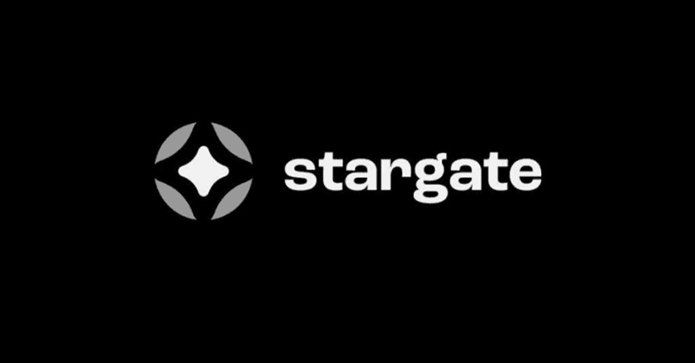

# Stargate-Bridger

 [My Profile](https://github.com/ryu666zaki/) | [My projects](https://github.com/ryu666zaki?tab=repositories) |
  🍩**Donate**: `0x27512edc51cAd8a5277090183858677915CC95c4`




## <sup>Simple script to bridge USDC from Polygon to Fantom and back on Stargate.finance</sup>

### <sup>***❗You need to have Python 3.10+ installed❗***</sup>


  1. Fund your wallet in the **Polygon** network with USDC and some Matic for transaction fees, and **Fantom** network with some FTM for transaction fees.

  2. **Clone repository** to yours system.

> Open your development environment, such as VSCode or Pycharm. Select the option to clone repo by link and paste the link to this repo.

  3. Open terminal in the same folder as main.py and run this commands:

```
python3.10 -m venv .venv
source .venv/bin/activate
pip install web3
```

  4. In the **main.py** file, on **line 619** inside the list, create a transaction to suit your needs. You can find an example of how to do this there as well.
     Specify the number of min and max amounts for the transaction on **lines 663 and 664** in the **main.py**
     Slippage - **line 673**. 
   > Put your private keys in private_keys.txt

  5. Now you're ready to start:
  ```
  python main.py
  ```

6. Angle bridge release for Celo and Gnosis network. Change to your RPC.

### angle_bridge донат можно сюда `0xe63F5DF79667BfAa7fE002382299d1a4F0a94AEE`

## 👨‍💻 All of my projects are available [here](https://github.com/ryu666zaki?tab=repositories)

#### 🍩Donate: `0x27512edc51cAd8a5277090183858677915CC95c4`
"# stargate_angle_bridges"

